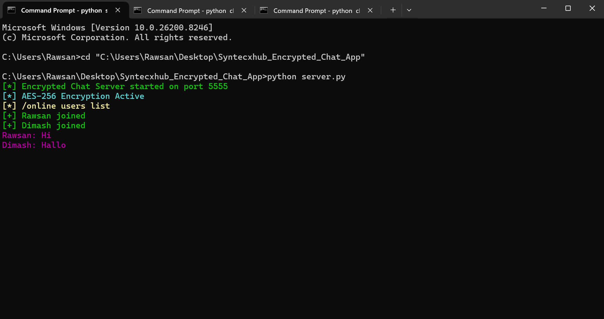

# SyntecXHub - Encrypted Chat App

**Project 1 - Cyber Security Week 2**

A secure client-server chat application where all messages are encrypted using **AES-256** before transmission.

---

## ✨ Features

- Real-time multi-client chat using TCP sockets
- AES-256 encryption in CBC mode with random IV for every message
- Username support for each client
- `/users` command to list online users
- Colorful and user-friendly terminal interface
- Message logging to `chat_log.txt`
- Proper error handling and graceful disconnection

---

## 🛠 Technologies Used

- Python 3
- `socket` module (TCP communication)
- `cryptography` library (AES-256 encryption)
- Threading (for handling multiple clients)

---

## 🚀 How to Run

### 1. Install Dependencies
```bash
pip install cryptography

### 2. Start the Server (First)
cd C:\Users\Rawsan\Desktop\Syntecxhub_Encrypted_Chat_App
python server.py

### 3. Start Clients (Open multiple terminals)
cd C:\Users\Rawsan\Desktop\Syntecxhub_Encrypted_Chat_App
python client.py

Enter different usernames in each client
Type messages normally
Type /users to see who is online
Type quit or exit to leave the chat

📁 Project Structure

Syntecxhub_Encrypted_Chat_App/
├── server.py
├── client.py
├── chat_log.txt          # Auto-generated log file
└── README.md

📸 Screenshots

## 📸 Screenshots

### 1. Server Running with Connected Clients


### 2. Real-time Chat between Clients


### 3. /users Command Output


*(Click on images to enlarge)*
Server running with connected clients
Two clients chatting with each other
/users command output
Message exchange example

🔒 Security Features

All messages are encrypted using AES-256-CBC mode
Random Initialization Vector (IV) used for every message
Messages are never transmitted in plain text
Secure encryption/decryption on both client and server side
